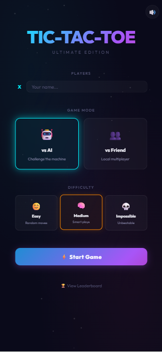
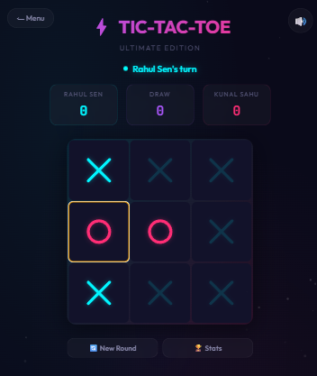
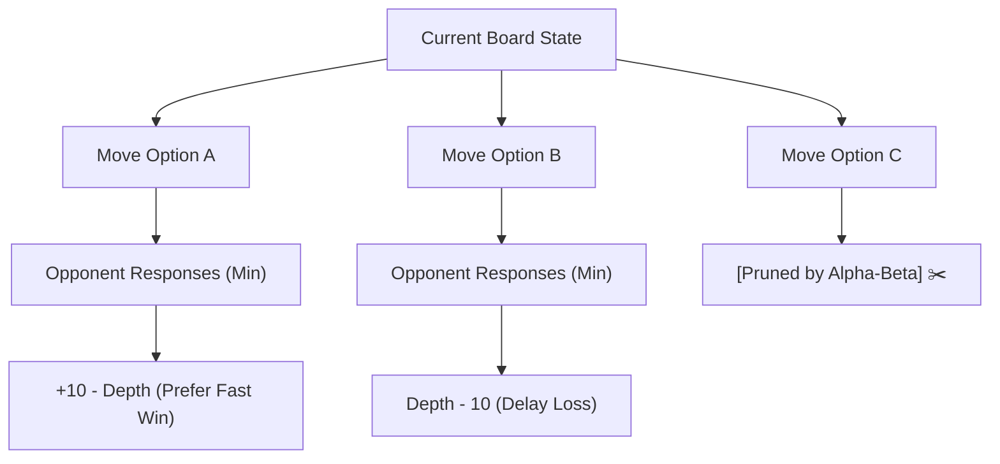

<div align="center">

# ⚡ CYBER TIC-TAC-TOE ⚡
### *The Classic 3×3 Reimagined with Unbeatable AI, Procedural Audio & Neon Aesthetics*

<br/>

[](https://react.dev/)
[](https://www.typescriptlang.org/)
[](https://vitejs.dev/)
[](https://nodejs.org/)
[](https://www.mongodb.com/)
[](LICENSE)

<br/>

[✨ Features](#-key-features) •
[📸 Screenshots](#-visual-showcase) •
[🧠 The AI Engine](#-the-ai-engine--how-it-works) •
[🚀 Quick Start](#-getting-started) •
[🔮 Roadmap](#-future-roadmap) •
[🤝 Contributing](#-contributing)

<br/>

---

</div>

<br/>

## 📸 Visual Showcase

<div align="center">

| 🎮 Main Menu & Mode Selection | ⚔️ Cyber-Neon Live Gameplay |
|:---:|:---:|
|  |  |
| *Custom avatars, AI difficulty switch, and dynamic mode setup* | *Active turn glowing indicators, streak counter, and audio toggle* |

</div>

<br/>

---

## 🌌 What is This?

**Cyber Tic-Tac-Toe** is not your standard weekend tutorial project. It is a full-stack, arcade-grade reimagining of the classic grid duel built with **React 19**, **TypeScript**, **Express 5**, and **MongoDB**. 

Infused with an electric cyberpunk visual identity, it pairs mathematically rigorous **Minimax Alpha-Beta Pruning** with zero-asset **Web Audio API** procedural sound synthesis, canvas-rendered particle physics, and a resilient dual-layer database fallback architecture.

> [!NOTE]
> Designed from the ground up to feel fast, tactile, and competitive. Whether you want to test your wits against an mathematically unbeatable machine or challenge a friend in pass-and-play mode, every move delivers responsive tactile and audio-visual feedback.

<br/>

---

## 💡 Why This Project?

Tic-Tac-Toe is widely known as a mathematically "solved game" — so why build it in 2026?

Because simplicity at the rule layer provides the ideal canvas for **engineering excellence** at the execution layer:

- **Zero-Asset Sound Engineering**: Why force players to download megabytes of MP3 files when you can synthesize rich retro game audio in real time using the browser's native Web Audio oscillators and frequency ramps?
- **Cognitive Challenge**: Rather than basic random choices, the AI implements an aggressive, depth-weighted **Minimax algorithm with Alpha-Beta Pruning** that actively plans ahead to trap human players.
- **Visual Euphoria**: Standard web UIs are static and dull. Cyber Tic-Tac-Toe leverages custom **Canvas 2D particle simulations**, dynamic SVG strike-through animations, and glassmorphic depth.
- **Fail-Safe Data Persistence**: Network drops? MongoDB down? The client seamlessly degrades to browser `localStorage` without interrupting a single game or losing streak records.

<br/>

---

## ✨ Key Features

<table>
  <tr>
    <td width="50%">
      <h3>🧠 Unbeatable Minimax AI</h3>
      <ul>
        <li><b>Impossible Mode</b>: Pure Minimax + Alpha-Beta Pruning with heuristic tie-break aggression. 100% unbeatable.</li>
        <li><b>Medium Mode</b>: Balanced tactical play (60% optimal moves with block-detection).</li>
        <li><b>Easy Mode</b>: Relaxed play (30% tactical, 70% exploratory).</li>
      </ul>
    </td>
    <td width="50%">
      <h3>🔊 Procedural Web Audio Synthesizer</h3>
      <ul>
        <li>Zero audio files downloaded — 100% synthesized in real time!</li>
        <li>Custom sine & triangle wave oscillators with exponential gain decay.</li>
        <li>Distinct sound signatures for moves, wins, ties, streak triggers, and menu buttons.</li>
      </ul>
    </td>
  </tr>
  <tr>
    <td width="50%">
      <h3>🎆 High-Octane Canvas Particles</h3>
      <ul>
        <li>Physics-driven 60 FPS HTML5 Canvas particle engine.</li>
        <li>Celebratory confetti cannon on standard victories.</li>
        <li><b>🔥 Fire Storm FX</b>: Secret plasma fountain unleashed when reaching a 5+ win streak!</li>
      </ul>
    </td>
    <td width="50%">
      <h3>🏆 Persistent Real-Time Leaderboard</h3>
      <ul>
        <li>Node.js + Express 5 REST backend backed by MongoDB Atlas.</li>
        <li>Tracks wins, losses, draws, current streaks, and all-time best streaks.</li>
        <li><b>Hybrid Fallback Engine</b>: Operates effortlessly offline with automatic local storage sync.</li>
      </ul>
    </td>
  </tr>
  <tr>
    <td width="50%">
      <h3>🎮 Multiple Game Modes</h3>
      <ul>
        <li><b>Player vs AI</b>: Single-player duel with 3 difficulty tiers.</li>
        <li><b>Player vs Player</b>: Local pass-and-play with custom player names and personalized neon markers.</li>
      </ul>
    </td>
    <td width="50%">
      <h3>💎 Cyber-Neon Glassmorphic Design</h3>
      <ul>
        <li>Bespoke design system featuring glowing cyan (<code>#00f5ff</code>) and electric magenta (<code>#ff2d75</code>).</li>
        <li>Custom typography pairing <i>Outfit</i> and <i>JetBrains Mono</i>.</li>
        <li>Smooth glass surfaces, pulsing turn highlights, and animated winning strike lines.</li>
      </ul>
    </td>
  </tr>
</table>

<br/>

---

## 🧠 The AI Engine & How It Works

The AI's decision-making in **Impossible** mode is guided by the **Minimax Algorithm** augmented with **Alpha-Beta Pruning**:



### 1. Mathematical Score Calculation
Every terminal state is evaluated:
$$\text{Score}_{\text{win}} = +10 - \text{Depth}$$
$$\text{Score}_{\text{loss}} = \text{Depth} - 10$$
$$\text{Score}_{\text{draw}} = 0$$

By factoring in **tree depth**, the engine always chooses the quickest route to victory and the most resilient path when defending against mistakes.

### 2. Aggressive Heuristic Tie-Breaking
When multiple moves yield identical optimal minimax scores, the AI evaluates candidate moves using a secondary **aggression & trap-setting heuristic** to construct multi-threat setups (forks) that guarantee future victories.

<br/>

---

## 🏗️ System Architecture

```
┌────────────────────────────────────────────────────────┐
│                   React 19 Frontend                    │
│                                                        │
│  ┌────────────────┐  ┌────────────────┐  ┌───────────┐ │
│  │   GameState    │  │ Web Audio Synth│  │  Particle │ │
│  │   Hook & FSM   │  │   Oscillators  │  │  Canvas   │ │
│  └───────┬────────┘  └────────────────┘  └───────────┘ │
│          │                                             │
│          ▼                                             │
│  ┌────────────────┐                                    │
│  │ Minimax Engine │                                    │
│  │ (Alpha-Beta)   │                                    │
│  └────────────────┘                                    │
└──────────┬─────────────────────────────────────────────┘
           │ HTTP REST API (/api/leaderboard)
           ▼
┌────────────────────────────────────────────────────────┐
│                   Express 5 Server                     │
│                                                        │
│       ┌──────────────┐         ┌────────────────┐      │
│       │ Health Check │         │ Leaderboard    │      │
│       │ /api/health  │         │ Controller     │      │
│       └──────────────┘         └────────┬───────┘      │
└─────────────────────────────────────────┼──────────────┘
                                          ▼
                         ┌─────────────────────────────────┐
                         │      MongoDB Atlas Database     │
                         │   (Fallback to localStorage)    │
                         └─────────────────────────────────┘
```

<br/>

---

## 🛠️ Tech Stack & Standout Mechanisms

| Domain | Technology | Highlights |
|:---|:---|:---|
| **Frontend Core** | React 19, TypeScript | Strict typing, modern hooks, blazing fast state synchronization |
| **Build & Tooling** | Vite 8, ESLint | Instant Hot Module Replacement (HMR) & zero-latency dev cycle |
| **Styling** | Vanilla CSS3, Modern Glassmorphism | Custom design tokens, CSS variables, backdrop blur, neon drop-shadows |
| **Audio Engine** | Web Audio API | Zero asset downloads, mathematical synthesis with gain envelope ramping |
| **Particle Physics** | HTML5 Canvas 2D | Custom physics particle engine running smoothly at 60 FPS |
| **Server Backend** | Express 5, Node.js | Concurrent runner, RESTful architecture, built-in production static asset server |
| **Database** | MongoDB Atlas Native Driver | Player stats, win-loss aggregation, streak tracking with automatic offline fallback |

<br/>

---

## 🚀 Getting Started

Follow these steps to run Cyber Tic-Tac-Toe on your local machine:

### 1. Clone the Repository
```bash
git clone https://github.com/Arko-009/Tic-Tac-Toe.git
cd Tic-Tac-Toe
```

### 2. Install Dependencies
```bash
npm install
```

### 3. Environment Configuration
Create a `.env` file in the root directory (or copy `.env.example`):
```bash
cp .env.example .env
```
Populate it with your settings:
```env
PORT=3001
MONGODB_URI=mongodb+srv://<username>:<password>@cluster0.your-subdomain.mongodb.net/tictactoe?retryWrites=true&w=majority
```
> [!TIP]
> **Don't have a MongoDB connection right now?** No problem! The application automatically detects offline database states and seamlessly falls back to client-side `localStorage`.

### 4. Run Development Server
Run both client and backend concurrently with one command:
```bash
npm run dev
```
Open your browser and navigate to:
```
http://localhost:5173
```

<br/>

---

## 📜 Available Scripts

In the project root, you can run:

| Command | Action |
|:---|:---|
| `npm run dev` | Runs both backend Express server and Vite frontend concurrently |
| `npm run server` | Starts only the Node.js Express API server (`PORT=3001`) |
| `npm run build` | Performs TypeScript type checks and compiles production assets into `/dist` |
| `npm run preview` | Previews the compiled production build locally |
| `npm run lint` | Analyzes code for stylistic and linting issues |

<br/>

---

## 🔮 Future Roadmap

We are constantly evolving! Here is what is on the horizon for future iterations:

- [ ] 🌐 **Real-Time Online Multiplayer**: Challenge friends across the web via WebSockets / Socket.io room matchmaking.
- [ ] 📐 **Expanded Grid Formats**: 4×4 and 5×5 boards with customizable win conditions (Connect-4 / Gomoku modes).
- [ ] 🎨 **Dynamic Theme Engine**: Switch between *Synthwave 80s*, *Matrix Terminal*, *AMOLED Void*, and *Cyberpunk Amber*.
- [ ] 🏅 **Global Competitive Ranking**: ELO rating algorithm with tiered league badges (Bronze to Grandmaster).
- [ ] 📱 **Progressive Web App (PWA)**: Full offline play with custom home screen install and haptic vibrations.

<br/>

---

## 🤝 Contributing

Contributions, issues, and feature requests are welcome! Feel free to check the [issues page](https://github.com/Arko-009/Tic-Tac-Toe/issues).

1. Fork the Project
2. Create your Feature Branch (`git checkout -b feature/EpicFeature`)
3. Commit your Changes (`git commit -m 'Add some EpicFeature'`)
4. Push to the Branch (`git push origin feature/EpicFeature`)
5. Open a Pull Request

<br/>

---

## 📄 License

Distributed under the **MIT License**. See `LICENSE` for more information.

<div align="center">

<br/>

**Crafted with ⚡ and passion by [Arko-009](https://github.com/Arko-009)**

*Give this repository a ⭐ if you enjoyed challenging the AI!*

</div>
